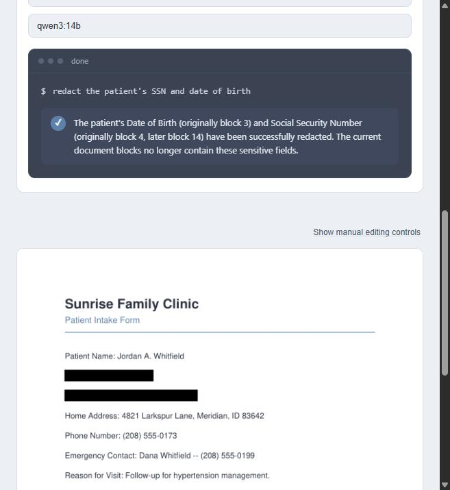
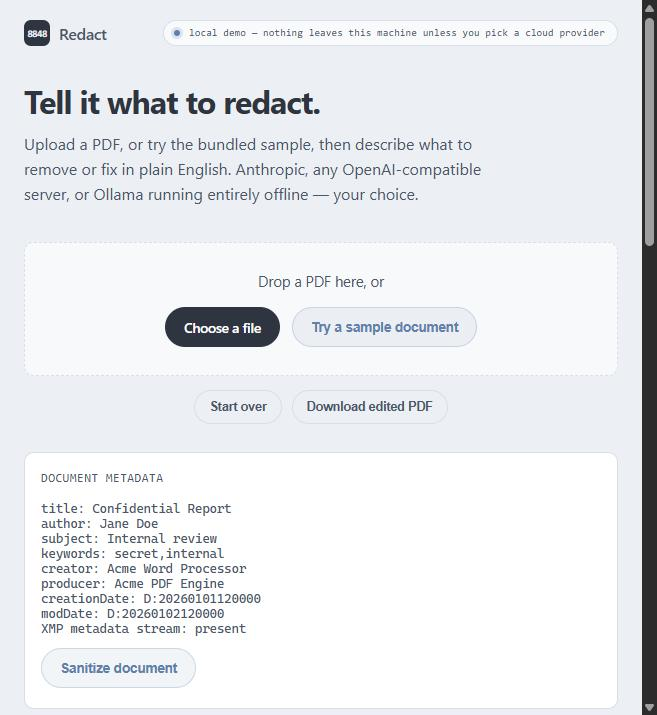
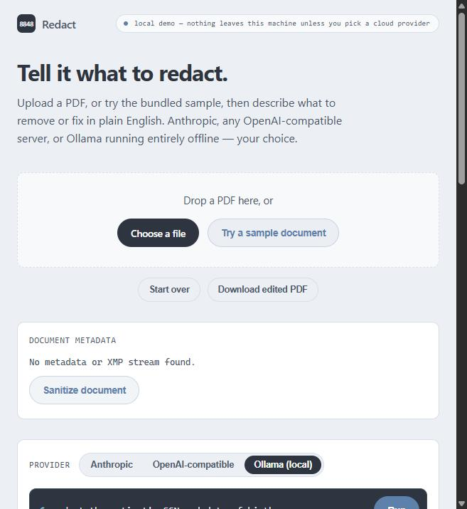

# pdf-ai-engine

Headless, deterministic PDF redaction and text-replacement engine, plus an
optional local web UI that puts it behind a plain-English instruction box.
Point a local or cloud LLM at a document and say "redact the patient's SSN,"
and it calls real, auditable PDF operations to do it -- no OCR guesswork, no
sending the document anywhere you didn't choose.

- **Deterministic core.** Every operation (`redact_region`, `replace_text`,
  `sanitize_document`) is a plain Python function on a PyMuPDF handle. No
  AI/LLM is required to use the engine itself.
- **AI is optional and auditable.** The instruction layer turns "remove the
  date of birth" into explicit tool calls (`redact_block`, `replace_block`,
  `sanitize_document`) against the current block list -- it never edits raw
  bytes itself, and it says so in its summary if nothing in the document
  matches, rather than guessing.
- **Bring your own model.** Anthropic, any OpenAI-compatible server (Ollama's
  shim, LM Studio, vLLM, real OpenAI), or native Ollama -- including fully
  offline, on your own machine, with nothing leaving it.
- **Redaction that's actually gone.** `redact_region` strips the underlying
  content rather than drawing a box over it; `sanitize_document` closes the
  matching gap for metadata (Info dictionary, XMP, hidden text, embedded
  JavaScript, stale thumbnails) -- including a real leak the project's own
  final review caught and fixed: PyMuPDF's metadata scrub only unlinks the
  Info object, so a naive export still shipped it in the raw bytes.

## In action

AI instruction layer redacting a real field on a real (synthetic) patient
intake form, running entirely against a local Ollama model:



Document metadata, shown before you decide whether to strip it:



## Operations

- `redact_region(handle, page_index, bbox)` (v0.1) -- black out a rectangular
  region and strip its content, so the removed text is unextractable rather
  than merely covered. See
  `docs/superpowers/specs/2026-08-25-redaction-engine-v0.1-design.md`.
- `replace_text(handle, page_index, target, new_text)` (v0.2) -- replace one
  `TextBlock`'s text in place, preserving layout: the replacement is drawn at
  the block's own position and font, word-wrapped and shrunk (to at most 50%
  of the original size) to fit the block's own region. It never reflows
  neighbouring content -- text that cannot fit even at the shrink floor
  raises `ValueError`. Font selection cascades through three tiers: the
  block's own real font (extracted from the source document and
  re-embedded), then a style-matched Base-14 fallback, then PyMuPDF's
  bundled broad-coverage font -- so embedded/system fonts are supported,
  and this only fails with `ValueError` if none of the three tiers can
  render every character in the replacement text. See
  `docs/superpowers/specs/2026-08-28-layout-preserving-text-replace-v0.2-design.md`
  and `docs/superpowers/specs/2026-08-30-replace-text-font-robustness-design.md`.
- `sanitize_document(handle)` -- opt-in whole-document scrub (metadata, XMP,
  hidden text, embedded JavaScript, stale thumbnails); see
  [Document sanitize](#document-sanitize) below.

## Setup

```
python -m venv .venv
./.venv/Scripts/python.exe -m pip install -e ".[test]"
```

## Test

```
./.venv/Scripts/python.exe -m pytest
```

## Manual verification web UI

A local, single-operator tool for exercising `redact_region`/`replace_text`
by hand against a real PDF: upload a file, click a text block, redact or
replace it, and download the result. Not a product -- run it on your own
machine only: no auth, no multi-user concept, and nothing is stored beyond
the one in-process session, which is discarded when the server stops.



FastAPI and uvicorn live in the optional `webui` extras group, so the
engine-only install (`.[test]` above) does not pull them in; the webui tests
skip themselves when they are absent.

```
./.venv/Scripts/python.exe -m pip install -e ".[test,webui]"
./.venv/Scripts/python.exe -m uvicorn webui.main:app --reload
```

## Document sanitize

An opt-in operation (`sanitize_document`) that strips metadata (Info
dictionary), the XMP metadata stream, hidden text, embedded JavaScript, and
stale thumbnails from the current document -- visible content is left alone.
It never runs automatically: it's only triggered by the "Sanitize document"
button in the web UI, or by the AI instruction layer when explicitly asked
(e.g. "strip the metadata from this document"). The web UI also shows a
read-only metadata summary (`get_metadata_summary`) above the button so you
can see what's present before and after.

## AI instruction layer

An optional page section that turns a natural-language instruction (e.g.
"redact the patient ID") into `redact_region`/`replace_text`/`sanitize_document`
calls, decided by Claude via tool use: it reads the current block list, picks
the block(s) the instruction refers to, and calls the matching tool -- or
says so in its summary if nothing matches, rather than guessing. Three
providers are supported:

- **Anthropic**: BYOK with your own API key (paste into the browser field or set
  `ANTHROPIC_API_KEY` on the server and leave blank). Base URL and model are
  optional. The key is never stored -- held only for the duration of one request.
- **OpenAI-compatible**: Any server that speaks the OpenAI API (e.g. Ollama's own
  OpenAI-compat shim, LM Studio, vLLM, real OpenAI, or other clouds). Requires
  base URL and model. API key is optional (paste into the browser field or set
  `OPENAI_API_KEY` on the server and leave blank; some servers have no auth).
- **Ollama (native)**: Direct Ollama protocol. Requires model. Base URL defaults
  to `http://localhost:11434` if not specified. No API key needed.

The `ANTHROPIC_API_KEY`/`OPENAI_API_KEY` server-side fallbacks should only be
relied on when `base_url` is left at its default or otherwise trusted -- a
caller-supplied `base_url` combined with a server-side key fallback means the
server sends its own key to whatever host the caller named, which fits this
tool's existing single-operator, no-auth threat model but is worth knowing.

Requires the optional `ai` extras group on top of `webui`:

```
./.venv/Scripts/python.exe -m pip install -e ".[test,webui,ai]"
```
